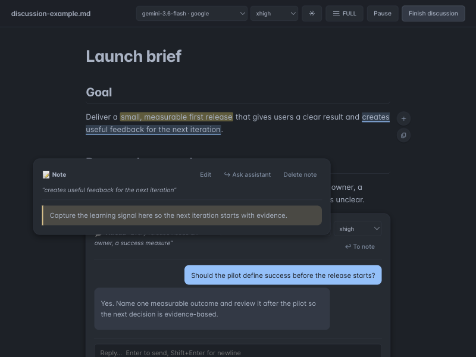

# Inline Discussion

`inline-discussion` turns a Markdown document—or another document converted to
Markdown—into a local human-to-agent workspace. Work on the document with an
agent, open focused side conversations beside the exact text, and hand the
resulting action items back to the main agent for document updates without
leaving the document view.

## What it provides

- A local browser UI that renders Markdown, Mermaid diagrams, local file links,
  source locations, and agent-assisted document updates.
- Agent-driven conversion of non-Markdown documents, including PDFs, Word
  documents, slides, spreadsheets, images, and scans, into reviewable Markdown
  while preserving extractable structure and content.
- Focused threaded comments and notes anchored to selected text, quotes, or
  whole blocks, so side conversations stay attached to their evidence.
- Per-thread Codex, Claude, or Xedoc inference settings, with conversation history
  preserved for each review thread.
- An explicit Apply/Finish handoff: focused side threads return agreed action
  items to the main agent, which amends the document while the discussion stays
  in the same view.
- A local loopback HTTP server with live updates, no externally hosted document
  viewer, and browser-mediated approval for permission-gated MCP calls.
- Markdown writing conventions for portable links and diagrams.

## Why it exists

Long specifications, reviews, and generated reports are difficult to improve
when the document, the discussion, and the agent updating it live in different
places. Inline Discussion keeps focused conversations beside their evidence and
returns their action items to the main agent, preserving one continuous
document-editing workflow.

## See it in action

Select text to highlight it, leave a note, or start a focused conversation with
an agent. This local example shows highlighted text, an anchored note, and a
short human-to-agent thread inside the document workspace.

Read the [example discussion document](assets/discussion-example.md).

## When to use it

Use it to review a proposal, research report, incident note, Markdown document,
or another source document that should be converted into Markdown for a local
human-to-agent discussion. The standalone `inline-discussion` CLI is installed
by `./install.sh`; the plugin supports Codex, Claude Code, and Xedoc.

See the [tool README](../../tools/inline-discussion/README.md) for launcher
commands and the [marketplace README](../../README.md#install) for installation.
