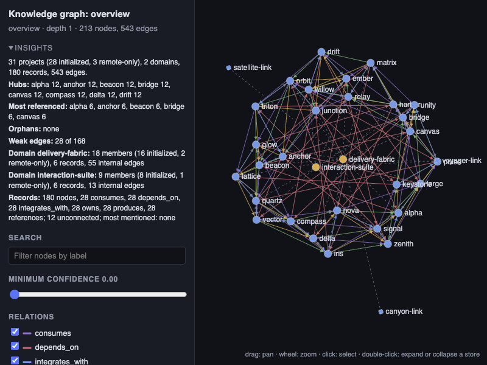

# Project Context Curator

`project-context-curator` gives agents durable, reviewable project knowledge
instead of relying on transient conversation memory. It exists to make future
sessions start from verified architecture, terminology, storage, and workflow
decisions while keeping private context private.

> [!IMPORTANT]
> **The curator learns automatically.** During normal agent work, it builds and
> maintains a durable, verified knowledge base from reusable project facts. It
> does not retain raw chat history or ordinary implementation details.

## What it provides

- Guided initialization that records non-empty, verified project context rather
  than creating an empty memory file.
- Canonical local or Git-backed storage, plus migration that preserves record
  identity and provenance.
- Typed applicability for project, domain, user, machine, and universal facts;
  user and machine facts remain private in XDG storage.
- Session-start retrieval guidance, generated human-readable views, and
  hybrid search across relevant project and configured shared context, with
  deterministic abbreviation, morphology, and identifier reranking.
- A context audit for stale, duplicated, divergent, dead-path, time-bound, and
  oversized records.
- Explicit snapshot enrollment for optional cross-project retrieval. New
  projects are never silently added to that index; a rejected current-project
  prompt can be deferred privately with `global-enroll --defer-current`.
- User-confirmed domain roots that automatically add current and future
  initialized or bound repositories while keeping local paths private.
- Read-only graph exports in text, JSON, Mermaid, DOT, and self-contained HTML
  for inspecting project relationships, domains, record shadows, and
  divergences.

## Optional shared context

Enable shared context when agents should discover durable knowledge in related
repositories. Setup previews the exact repositories and storage policy before
anything is indexed or initialized; repositories are not silently added, and
private user or machine facts remain private.

## Why it exists

Important project knowledge is often rediscovered in every new agent session,
then lost again with the conversation. The curator keeps only durable facts,
preserves their source and scope, and provides a review path when that
knowledge becomes stale. Its explicit enrollment and private-scope boundaries
avoid turning a convenience index into an unreviewed data-sharing mechanism.

## Xedoc and Codex compatibility

Xedoc supports the `context.thread` extension, which inserts the curator's
durable-knowledge guidance as a fixed context block for each active thread.
Codex does not support that manifest field, so its SessionStart hook provides
the complete retrieval and capture policy. Codex and Claude Code register a
UserPromptSubmit hook that reinforces the essentials every fourth top-level
user turn. Xedoc selects a SessionStart-only hook file alongside its persistent
thread context and does not register the periodic reminder.

## Knowledge graph

The graph makes cross-project context easier to understand: explore
dependencies, domains, shared records, and duplicate or divergent definitions
before they become stale or inconsistent.

Open the [interactive HTML demo](assets/knowledge-graph-demo.html) to inspect
graph search, relationship filters, and node details.

## When to use it

Use the curator when a repository needs persistent terminology, architecture
decisions, component ownership, or cross-project context. It also fits context
hygiene reviews and graph exploration. The plugin supports Xedoc, Codex, and
Claude Code; install it through the [marketplace README](../../README.md#install), then
invoke the relevant `project-context-curator:*` skill.
